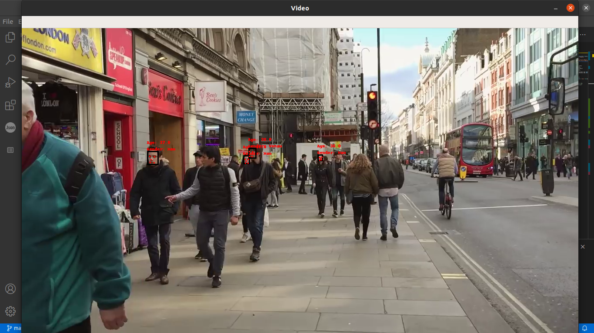

# Age - Gender Estimator in Real Time / Video Applications

Age-Gender Estimator is built by utilizing Pytorch frame. By utilizing SquezeeNet network, an estimator is created.   
.
## Data Preparation 

For training process, a data collection operation is done. Data has been retrieved from open-source datasets.These datasets contains images from IMDB and Wikipedia websites. The dataset has subfolders that contains images and with respect to alignment of images a Mat file holds labels for each images. 

Hence an extraction operation for labels was mandatory.
#### DataSets
* [IMDB and WIKI](https://data.vision.ee.ethz.ch/cvl/rrothe/imdb-wiki/) 
* [UTK](https://susanqq.github.io/UTKFace/)

Under /data_op folder, these two operation handlers can be found. Before starting the training this operation should be done unless train files need to be rearranged.

## Training
For training part there are two subfolders having two other networks. Under /arranged-model, there is model that is built with seeking best accuracy. It's dataloader, loss and train modules are included too. 

On the other hand, we have another file for training that emerges Squezeenet implementation. In this subfolder, all needed modules are bolstered. 

For training :
```sh
$ python3 train.py --data <str> [options]
$ python3 train.py --data <str> --lr <float> --wd <float> --batch_size <int> --checkpoint <str> --resume <str> --epoch <int> --num_works <int> --log <str> --print_freq <int>
```
For running the command, it is mandatory to specify the dataset path, other variables are predefined however if different approaches are intended to attempt on, they can be redefined by running second command.

In both of the training scripts, Tensorboard visualisation tool is invoked and the graphs of loss and accuracy metrics can be followed via this tool. 

## Real Time Application

After completing all epochs that is defined, a model is created. The created model can be implemented to a video or a live recording. For this purpose, the scripts under /detection_video_operation can be utilized. By having the contents in same directory, this command can be run. Video path can be defined for a specified video or a live session is requested video_path can be called as 0.

The alignment and detection parts are modified from a [repo](https://github.com/ZhaoJ9014/face.evoLVe.PyTorch/tree/master/align) for specified requirements. 

```sh
$ python3 videoprocess.py  --video_path <str> 
```
For example:


The results can be seen in each frame, for better FPS, more qualified GPU would be  much more helpful.


